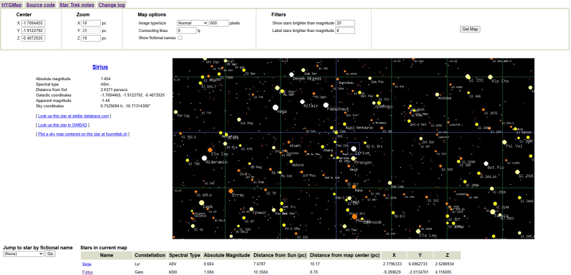

# HYGMap

Interactive 3D star mapping application showing nearby stars with real astronomical data and fictional sci-fi locations.



## Features

- **2,500,000+ stars** from the AT-HYG Database
- **Two interfaces** - Classic 2D PHP app and modern 3D React frontend
- **3D galactic visualization** with zoom, pan, and filter controls
- **Fictional star names** from sci-fi universes (Star Trek, Babylon 5, etc.)
- **Real astronomical data** including spectral types, magnitudes, distances
- **SETI signal visualization** - see how far radio messages have traveled
- **Fast PostgreSQL backend** with spatial indexing
- **REST API** with Swagger documentation
- **Dockerized deployment** - runs anywhere with 4 containers

## Quick Start

```bash
git clone https://github.com/jswhitten/hygmap.git
cd hygmap
cp .env.example .env
nano .env  # Set your database password

# Build and start all 4 services
docker compose up -d --build
```

No manual data downloads required - the database container automatically downloads the AT-HYG star catalog during build.

The first startup takes 2-3 minutes as the database imports 2.5 million stars. Monitor progress with:

```bash
docker compose logs -f hygmap-db
```

## Access the Application

| Service | URL | Description |
|---------|-----|-------------|
| **PHP App** | http://localhost/ | Classic 2D star map interface |
| **React Frontend** | http://localhost:5173/ | Modern 3D interactive visualization |
| **API Docs** | http://localhost:8000/docs | Swagger API documentation |
| **API Health** | http://localhost:8000/health | API health check |

## Architecture

HYGMap runs as 4 Docker containers sharing a single PostgreSQL database:

| Container | Port | Technology | Description |
|-----------|------|------------|-------------|
| `hygmap-db` | 5432 | PostgreSQL 15 | Star database with 2.5M+ stars |
| `hygmap-php` | 80 | Apache/PHP 8.2 | Classic server-rendered interface |
| `hygmap-api` | 8000 | FastAPI/Python | REST API for React frontend |
| `hygmap-frontend` | 5173 | React/Three.js | Modern 3D visualization |

## How It Works

HYGMap displays stars in **galactic coordinates** centered on our solar system:

- **X-axis:** Points toward galactic center (~26,700 light years away)
- **Y-axis:** Points toward 90° galactic longitude (Cygnus direction)
- **Z-axis:** Points "up" from the galactic plane
- **Origin (0,0,0):** Our Sun's position

### Interfaces

**PHP App (Classic):** Server-rendered 2D star maps with GD-generated images. Includes sortable data tables, CSV export, and configurable map settings.

**React Frontend (3D):** Real-time 3D visualization using Three.js. Navigate through the star field with mouse controls, see SETI signals as expanding spheres, and click stars for detailed information.

### Features

- 2.5M+ stars from the AT-HYG 3.2 catalog with accurate spatial coordinates
- Multi-fiction layers: toggle between real star names and those from Star Trek, Babylon 5, and more
- Interactive 2D/3D visualizations with zoom, pan, and stereoscopic or printable modes
- Search by catalog ID (HD, HIP, Gaia, Gl/GJ, TYC), Bayer/Flamsteed name, or proper name
- Sortable data table of stars in view
- Configurable map settings (units, magnitude limits, layer selection)
- SETI signal data showing historical transmissions and received signals

## Data Sources

- **[AT-HYG Database](https://codeberg.org/astronexus/athyg)** - Compiled by David Nash
  - Tycho-2, compiled by the Hipparcos mission
  - Gaia Data Release 3
  - The Hipparcos Catalog
  - The Yale Bright Star Catalog
  - The Gliese-Jahreiss Catalog
  - Star names from the IAU's official list of names

The AT-HYG database includes over 2.5 million stars; essentially all known stars within 25 parsecs or brighter than magnitude 11.

## Documentation

- **[Setup Guide](docs/setup.md)** - Installation and configuration
- **[User Guide](docs/user-guide.md)** - How to navigate and use the star map
- **[Docker Commands](docs/docker-commands.md)** - Container management
- **[API Reference](docs/api.md)** - REST API and PHP endpoints
- **[Database Schema](docs/database.md)** - Star catalog structure
- **[DigitalOcean Deployment](docs/digitalocean-deployment.md)** - Production deployment guide
- **[Contributing](CONTRIBUTING.md)** - How to contribute

## Technology Stack

| Component | Technology |
|-----------|------------|
| **Classic Frontend** | PHP 8.2, Apache, GD library |
| **Modern Frontend** | React 18, Three.js, TypeScript, Vite |
| **API Backend** | FastAPI, Python 3.11, SQLAlchemy |
| **Database** | PostgreSQL 15 |
| **Testing** | PHPUnit, pytest, Vitest, PHPStan |
| **Deployment** | Docker, GitHub Container Registry |

## Requirements

- Docker and Docker Compose
- 2GB RAM minimum (4GB recommended)
- 1GB disk space for containers and database

## Development

All tests run inside Docker containers - no local installations required.

```bash
# Run all tests (PHP + API + Frontend)
make test

# PHP tests
make test-unit        # Unit tests (fast, no database)
make test-integration # Integration tests (needs database)
make analyse          # PHPStan static analysis

# API tests
make test-api

# Frontend tests
make test-frontend
make lint-frontend    # ESLint

# Full CI pipeline
make ci

# See all available commands
make help
```

## Contributing

Contributions welcome! Areas of interest:
- Additional sci-fi universe star names
- UI improvements
- Performance optimizations
- Documentation improvements

See [CONTRIBUTING.md](CONTRIBUTING.md) for details.

## License

MIT License - see LICENSE file for details.
